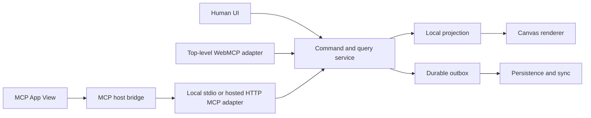

# Koi system design

Status: working agreement, 2026-08-27.

## Decision summary

Koi will be a DOM-first, local-first spatial editor with one shared command/query core. Human UI, WebMCP, and MCP servers are equal entry surfaces over that core. The browser renders actual HTML/CSS and Astryx components; SVG and Canvas2D serve their bounded roles, while every Koi-authored programmable GPU feature uses WebGPU and WGSL.

This gives Koi the product property that matters most: a human can directly edit a real web composition, and an agent can read the exact semantic result and continue without overwriting it.

## Product boundary

The first product is a Paper-style UI exploration surface that dogfoods Miro-style visual collaboration. A Page contains many independent Frames, like the six numbered Paper frames and the Astryx component studies in the reference screenshots. Frames can later coexist with connectors, notes, comments, freehand ink, shapes, and other whiteboard utilities.

The following are deliberately outside the first vertical slice:

- arbitrary untrusted React packages or arbitrary JavaScript renderers;
- a Figma-compatible vector engine;
- full multiplayer, general-purpose CRDT state, and hosted organization features;
- WebGPU as a replacement for the DOM/SVG/Canvas2D canvas foundation, or Wasm in the core rendering path;
- arbitrary shader post-processing of live DOM subtrees.

Wasm remains a reserved optimization boundary. It must be justified by a measured CPU-heavy workload and must work across the intended MCP host security policies before adoption.

## Shared application core



Adapters translate protocol requests; they do not mutate React state, dispatch pointer events, or own document semantics. The same command must produce equivalent validation, history, projection, and undo behavior regardless of its entry surface.

The browser API behind WebMCP remains isolated because it is evolving. That isolation does not make WebMCP experimental within Koi: WebMCP has product parity, documentation, acceptance tests, and a challenge release gate.

## Spatial and rendering architecture

```text
Viewport
├── background and grid
├── WorldRoot — one CSS camera transform
│   ├── SVG relationship plane
│   ├── positioned DOM Frames
│   │   ├── real HTML/CSS and Astryx component trees
│   │   └── optional WebGPU shader canvas leaves
│   └── committed SVG shapes and ink
├── Canvas2D HUD — active ink, guides, selection and cursors
└── DOM overlay — handles, text editing, comments and toolbars
```

### What each rendering layer solves

These layers are not competing canvas implementations. They share one Document and one camera, while each renders the kind of content browsers handle best.

| Layer | Coordinate space and lifetime | Responsibility |
| --- | --- | --- |
| DOM Frames | World space; durable | Actual HTML/CSS, Astryx components, text, notes, images, and product UI |
| SVG plane | World space; durable | Selectable connectors, geometric shapes, and initially committed pen paths |
| Canvas2D HUD | Screen space; transient | In-progress pen strokes, lasso, selection marquee, snap guides, hover feedback, and cursors |
| DOM overlay | Screen space; transient UI | Text inputs, comment popovers, resize handles, context menus, toolbars, keyboard focus, and ARIA semantics |
| WebGPU leaf | Inside a world-space Frame; durable element with animated pixels | Trusted procedural shaders and other bounded programmable GPU effects |

HUD means heads-up display: one transparent `<canvas>` lies above the world and is redrawn once per animation frame during an interaction. A pointer move therefore changes pixels in one bitmap instead of creating React, DOM, or SVG nodes. On pointer-up, Koi commits one semantic operation, such as a simplified SVG path, and clears the HUD. The HUD is deliberately unsuitable for editable text or accessible controls because its pixels have no individual DOM identity.

The DOM overlay is a separate layer above the transformed world. Koi converts an Element's world position to screen position and places ordinary HTML controls there. The controls stay readable at a constant screen size and retain native input, selection, focus, keyboard, and accessibility behavior while the content beneath them pans and zooms.

WebGPU runs WGSL render and compute pipelines in a `<canvas>`. It solves bounded programmable work such as procedural pixels, dense particles, image computation, and potentially very dense ink. It does not accelerate DOM layout and is not automatically faster for one small effect. Koi nevertheless standardizes on WebGPU so it has one modern programmable GPU model rather than parallel WebGL2/GLSL and WebGPU/WGSL implementations.

### Why one camera transform

Pan and zoom update one transform on `WorldRoot` once per animation frame, outside React reconciliation. A transform can stay in the compositor path; it is not intrinsically a source of lag. The common causes of lag are synchronous layout reads, React commits during gestures, paint-heavy effects, main-thread long tasks, excessive compositor layers, and repeated rerasterization while zooming.

`will-change` belongs only on the world root when evidence shows it helps. Koi must not promote every Element to its own layer.

### Why real DOM Frames

HTML/CSS fidelity is the product, not an implementation accident. Actual DOM preserves flex/grid behavior, editable text, semantics, accessibility, browser layout, Astryx rendering, and useful native web export. Replacing it with a custom pixel renderer would require Koi to rebuild layout, font shaping, focus, text editing, accessibility, and component behavior while losing source-of-truth fidelity.

The DOM does have a cost. Koi will scale at top-level Frame boundaries using the following mechanisms:

1. **Record-level subscriptions:** a Frame renderer subscribes to its own record and required design tokens rather than to the entire `elements` collection. Moving Frame A rerenders A and affected relationship/selection visuals, not every Frame. Camera state stays in an interaction controller and writes one root transform per animation frame instead of causing React commits.
2. **Cached geometry:** world bounds and connector anchors are retained in a geometry cache. `ResizeObserver` refreshes a Frame only when its rendered size actually changes. Pointer movement, hit testing, and connector routing read the cache instead of repeatedly calling `getBoundingClientRect()`, which could force synchronous layout.
3. **CSS containment:** a fixed-size Frame uses containment to tell the browser that its internal layout and painting cannot affect unrelated Frames. This narrows invalidation when a component changes. Size containment is not applied to a Frame whose dimensions must be derived from its children.
4. **Spatial indexing:** a world-space index maps bounding rectangles to Element IDs. Viewport, hit-test, lasso, and nearby-element queries inspect only candidates in the requested region rather than scanning every Element. Koi begins with a simple uniform grid and adopts a more complex tree only if measurement justifies it.
5. **Frame virtualization:** every Frame remains an exact Document record, but Koi mounts live DOM only for Frames intersecting the viewport plus an overscan margin. The margin prevents visible pop-in while panning. Selected, edited, dragged, or agent-highlighted Frames remain live even when just outside the viewport. Virtualization happens around whole Frames, never inside the HTML/CSS composition being designed.
6. **Distant previews:** when a Frame is so far away that its contents are subpixel, Koi can show a cached image or lightweight shell while preserving exact bounds, title, selection, and connector anchors. The live DOM returns when the Frame is near, selected, or edited. Preview invalidation follows document changes, not camera movement.
7. **Browser assistance:** `content-visibility` may reduce work further, but it is a secondary browser optimization rather than Koi's visibility model.

The rollout remains evidence-driven. The first small Page may keep all Frames live. Record subscriptions, a camera path outside React, containment, and geometry caching come first; the spatial index, Frame virtualization, and distant previews are enabled when representative fixtures show they are needed.

There is no useful universal DOM-node cap for an editor. Koi will establish limits from representative Page benchmarks, including the six-Frame Paper study, a tall Astryx foundations Frame, multiple component Frames, dense ink, and shader fixtures.

### Shapes, connectors, text, comments, and pen

SVG is the initial committed medium for connectors, geometric shapes, and simplified pen paths because it remains inspectable, selectable, and easy to anchor to DOM geometry. It is not the only non-DOM feature.

- Text being designed is a DOM Text element.
- Comments and editing controls use the screen-space DOM overlay.
- An active pen stroke is drawn in the Canvas2D HUD for low-latency input, simplified on pointer-up, then committed as an SVG path.
- Selection outlines, snap guides, remote cursors, and transient feedback use the Canvas2D HUD.
- If measured stroke density eventually exceeds SVG's viable range, committed ink can move behind the same scene abstraction to Canvas2D or WebGPU.

### WebGPU

WebGPU does not accelerate DOM style calculation, flex/grid layout, text editing, DOM hit testing, Canvas2D, or the browser compositor. It is therefore not the canvas foundation. It is Koi's only programmable GPU API: all Koi-authored GPU rendering and computation uses WebGPU and WGSL, and Koi ships no WebGL2/GLSL runtime backend.

GPU features remain capability-gated leaves. The editor, ordinary Frames, connectors, text, and transient HUD continue to work when an MCP host or browser does not expose WebGPU. A Shader element remains in the Document and renders a clear static preview or unsupported-state diagnostic rather than silently changing the artifact. Device loss, pixel budgets, offscreen suspension, and host compatibility are explicit test boundaries.

### Paper-style shaders

The DOM-first design supports the same product category as Paper-style shaders: a normal Frame can contain an absolutely positioned WebGPU canvas plus normal DOM children. A Shader element stores a trusted shader identity, serializable uniforms, playback speed, deterministic frame, and quality settings.

Paper's implementation remains useful reference material for observing size, capping backing pixels, and pausing static, hidden, or offscreen work. Koi will apply those resource principles to WebGPU while adding a Page-wide pixel and animation budget. Offscreen and distant shaders become snapshots; resolution is refreshed after zoom settles rather than reallocating every camera frame.

Koi will not ship Paper Shaders' WebGL runtime. A future WGSL implementation may reproduce supported effects with appropriate license and provenance notices. Applying a shader to a rasterized snapshot of arbitrary live DOM is a different feature and is not part of the initial contract.

## Document and command model

The persistent hierarchy is:

```text
Workspace
└── Document
    ├── Page
    │   └── Elements, including nested Frames
    ├── assets
    ├── design profile
    └── history identity
```

A command has this conceptual envelope:

```ts
type Command = {
  documentId: string
  commandId: string
  clientId: string
  clientSeq: number
  baseCursor: number
  origin: "human" | "agent"
  operations: Operation[]
}
```

Stable Element IDs and bounded semantic operations are the interoperability contract. DOM selectors, raw JavaScript, and whole-document replacement are not agent APIs.

## Local-first change flow

```mermaid
sequenceDiagram
  participant Actor as Human or agent
  participant Core as Command service
  participant DB as Local transaction
  participant View as Projection
  participant Sync as Remote persistence
  Actor->>Core: command with preconditions
  Core->>DB: validate and atomically append change + outbox
  DB-->>View: committed local revision
  View-->>Actor: visible result and command receipt
  DB->>Sync: asynchronous outbox delivery
  Sync-->>DB: acknowledgement or structured conflict
```

Pointer movement and text composition are transient interactions. A drag commits one move when it ends; typing is grouped at meaningful pauses and editor boundaries. This grouping is an undo policy, separate from sync, although both operate on the same semantic commands.

A successful mutating WebMCP call means the change is durably committed to the local Projection and outbox, not necessarily acknowledged by a remote server:

```json
{
  "ok": true,
  "commandId": "01...",
  "changedIds": ["element-7"],
  "viewRevision": 42,
  "syncStatus": "pending"
}
```

Mutations serialize per Document; snapshot queries may run concurrently. Cancellation is honored before commit. Once the local transaction commits, cancellation cannot truthfully pretend the mutation never occurred.

## Conflicts, collaboration, and undo

Koi uses record- or field-specific preconditions rather than rejecting every change when the global Document revision advances:

- unrelated property edits may merge;
- absolute move, resize, and agent layout require the expected geometry version;
- deletion wins over a stale update;
- an agent layout fails with a structured conflict when a human moved a protected target;
- one bounded agent command becomes one visible undo group;
- undo appends a compensating command rather than rewinding history.

This adopts the important lesson from DeltaDB-style ordered logs: stable identity, explicit causality, small deltas, deterministic replay, and local materialized state are more valuable than putting every field in a general CRDT. A server-ordered semantic event stream is the initial collaboration model. Yjs is reserved for genuinely concurrent rich text if measurements and product use demonstrate that need.

Agent activity is attributed in history and visible on the Page. It must not silently steal a human's Camera or Selection.

## First-class WebMCP contract

The top-level web app registers a stable tool catalog centrally. Tools do not appear and disappear with React component lifecycles or current selection. Selection, Camera, current Page, and Revision are returned as context.

The proposed challenge catalog is:

- `get_canvas_context`
- `list_components`
- `inspect_elements`
- `create_elements`
- `update_elements`
- `delete_elements`
- `arrange_elements`
- `export_document`

Every mutating tool uses bounded batches, stable IDs, preconditions, idempotency, structured failures, and the same undo/history rules as human edits. A retry without a reliable browser invocation ID is handled by Koi command IDs and operation semantics, not by guessing caller identity.

Tool descriptions are static and precise. Document text and agent-returned labels are untrusted content and are never interpolated into tool instructions.

## MCP App contract

An MCP server registers a tool with UI metadata and exposes a `ui://` resource containing a complete HTML document. The MCP host retrieves that resource, renders the View in a sandboxed iframe, and bridges JSON-RPC messages through `postMessage`. The host then proxies permitted MCP tool calls to the local stdio or hosted HTTP server.

`postMessage` is the universal View-to-host browser channel; it is not an agent protocol. A View never assumes that its `localhost` is the MCP server machine. Durable application work travels View → host bridge → MCP tool unless an explicitly allowed network origin is declared in the UI resource policy.

The View is an optimistic projection, not the only durable store. Tool handlers must exist before the View connects, and host capabilities such as theme, display mode, context, and available tools are negotiated rather than assumed.

## Persistence topology

| Surface | Durable design storage | Immediate projection |
| --- | --- | --- |
| Standalone local web + WebMCP | IndexedDB and `.koi.json` export | Browser local projection/outbox |
| Local or SSH stdio MCP | SQLite or files on the MCP server machine | MCP View projection through host calls |
| Hosted web app | IndexedDB replica/outbox converging with the service | Browser local projection |
| Hosted HTTP MCP App | PostgreSQL plus object storage | MCP View projection backed by tools |

MCP server processes are treated as stateless request handlers: document identity, idempotency, preconditions, and durable state are explicit rather than hidden in a long-lived session.

## Astryx, DESIGN.md, and export

Koi initially targets one trusted Astryx integration, not a universal component framework. Registry code is compiled with Koi and a registry entry describes:

- component kind and trusted renderer;
- validated serializable properties and slots;
- defaults and inspector controls;
- supported token bindings and preview fixtures;
- source version and licensing metadata;
- export behavior.

Raw DESIGN.md remains portable source intent. A versioned `koi.astryx` profile maps that intent to the exact Astryx concepts Koi supports. Koi does not fork DESIGN.md and does not invent a parallel universal token system. Profile upgrades are explicit one-way transformations to the currently supported runtime; obsolete runtime paths are removed rather than maintained as compatibility layers.

Mitosis and Panda may inform the design, but neither is currently required. The trusted registry is narrower, safer, and more faithful to Koi's first product.

## References

- [Astryx: Who needs a Figma library?](https://astryx.atmeta.com/blog/who-needs-a-figma-library)
- [MCP Apps API](https://apps.extensions.modelcontextprotocol.io/api/)
- [MCP Apps testing guide](https://github.com/modelcontextprotocol/ext-apps/blob/main/docs/testing-mcp-apps.md)
- [OpenAI WebMCP/site tools documentation](https://learn.chatgpt.com/docs/webmcp)
- [WebMCP draft](https://webmachinelearning.github.io/webmcp/)
- [Chrome WebMCP documentation](https://developer.chrome.com/docs/ai/webmcp)
- [Chrome rendering architecture](https://developer.chrome.com/docs/chromium/renderingng-architecture)
- [CSS animation performance](https://web.dev/articles/animations-guide)
- [DOM size and interactivity](https://web.dev/articles/dom-size-and-interactivity)
- [`content-visibility`](https://web.dev/articles/content-visibility)
- [Canvas API](https://developer.mozilla.org/en-US/docs/Web/API/Canvas_API)
- [CSS containment](https://developer.mozilla.org/en-US/docs/Web/CSS/contain)
- [WebGPU API](https://developer.mozilla.org/en-US/docs/Web/API/WebGPU_API)
- [WebGPU Shading Language](https://www.w3.org/TR/WGSL/)
- [Paper Shaders](https://github.com/paper-design/shaders)
- [Zed: Introducing DeltaDB](https://zed.dev/blog/introducing-deltadb)
