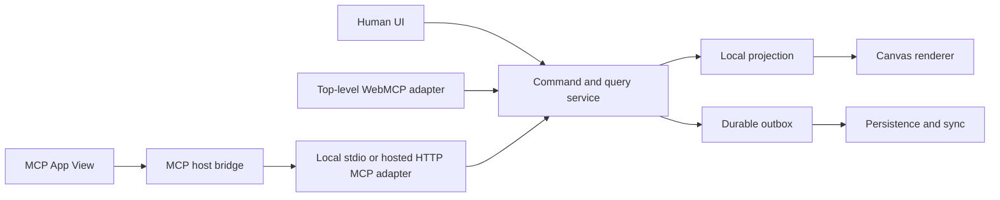

# Koi system design

Status: implemented MVP architecture and forward design, 2026-08-27.

## Decision summary

Koi will be a DOM-first, local-first spatial editor with one shared command/query core. Human UI, WebMCP, and MCP servers are equal entry surfaces over that core. The browser renders actual HTML/CSS and Astryx components; SVG and Canvas2D serve their bounded roles, while every Koi-authored programmable GPU feature uses WebGPU and WGSL.

This gives Koi the product property that matters most: a human can directly edit a real web composition, and an agent can read the exact semantic result and continue without overwriting it.

The implemented MVP includes the shared core, browser editor, IndexedDB persistence, WebMCP,
stdio and Streamable HTTP MCP Apps, and bounded file-backed REST hosting. Sections that describe
WebGPU effects, multiplayer, managed hosting, or complete native Page export are forward design,
not claims about the current build.

## Product boundary

The first product is a Paper-style UI exploration surface that dogfoods Miro-style visual collaboration. A Page contains many independent Frames, like the six numbered Paper frames and the Astryx component studies in the reference screenshots. Frames currently coexist with connectors, notes, freehand ink, and shapes; comments and additional whiteboard utilities remain future work.

The following are deliberately outside the first vertical slice:

- arbitrary untrusted React packages or arbitrary JavaScript renderers;
- a Figma-compatible vector engine;
- full multiplayer, general-purpose CRDT state, and hosted organization features;
- WebGPU as a replacement for the DOM/SVG/Canvas2D canvas foundation, or Wasm in the core rendering path;
- arbitrary shader post-processing of live DOM subtrees.

Wasm remains a reserved optimization boundary. It must be justified by a measured CPU-heavy workload and must work across the intended MCP host security policies before adoption.

## Shared application core



Adapters translate protocol requests; they do not dispatch pointer events or define document
semantics. The browser adapters use `EditorStore`, which commits through the same core reducer used
by MCP and REST. The current suites verify core invariants and each adapter independently; a stored
cross-surface parity suite remains to be added.

The browser API behind WebMCP remains isolated because it is evolving. That isolation does not make WebMCP experimental within Koi: WebMCP has product parity, documentation, acceptance tests, and a challenge release gate.

## Spatial and rendering architecture

```text
Viewport
├── background and grid
├── WorldRoot — one CSS camera transform
│   ├── SVG relationship plane
│   ├── positioned DOM Frames
│   │   ├── real HTML/CSS and Astryx component trees
│   │   └── optional WebGPU shader canvas leaves
│   └── committed SVG shapes and ink
├── Canvas2D HUD — active ink; guides, lasso and cursors are planned
└── DOM overlay — selection, resize and text-editing controls
```

### What each rendering layer solves

These layers are not competing canvas implementations. They share one Document and one camera, while each renders the kind of content browsers handle best.

| Layer        | Coordinate space and lifetime                                 | Current release responsibility                                                               |
| ------------ | ------------------------------------------------------------- | -------------------------------------------------------------------------------------------- |
| DOM Frames   | World space; durable                                          | Actual HTML/CSS, Astryx components, text, notes, images, and product UI                      |
| SVG plane    | World space; durable                                          | Selectable connectors, geometric shapes, and committed pen paths                             |
| Canvas2D HUD | Screen space; transient                                       | In-progress pen strokes; guides, lasso, and cursors remain planned                           |
| DOM overlay  | Screen space; transient UI                                    | Text inputs, resize/selection controls, keyboard focus, and native semantics                 |
| WebGPU leaf  | Reserved inside a world-space Frame; durable semantic Element | Static unsupported-state preview today; trusted bounded WGSL effects are a future capability |

HUD means heads-up display: one transparent `<canvas>` lies above the world and coalesces active
pen redraws to one animation frame. A pointer move therefore changes pixels in one bitmap instead
of creating React, DOM, or SVG nodes. On pointer-up, Koi commits one semantic SVG ink Element and
clears the HUD. The HUD is deliberately unsuitable for editable text or accessible controls
because its pixels have no individual DOM identity.

The DOM overlay is a separate layer above the transformed world. Koi converts an Element's world
position to screen position and places ordinary HTML controls there. The current selection,
resize, and text-editing controls stay readable at a constant screen size and retain native input,
selection, focus, and keyboard behavior while the content beneath them pans and zooms.

WebGPU runs WGSL render and compute pipelines in a `<canvas>`. It solves bounded programmable work such as procedural pixels, dense particles, image computation, and potentially very dense ink. It does not accelerate DOM layout and is not automatically faster for one small effect. Koi nevertheless standardizes on WebGPU so it has one modern programmable GPU model rather than parallel WebGL2/GLSL and WebGPU/WGSL implementations.

### Why one camera transform

Pan and zoom coalesce writes to one transform on `WorldRoot` per animation frame, outside React
reconciliation. The Canvas also throttles a React visibility refresh to at most once every 64 ms
during camera changes and refreshes once when a pointer pan ends. A transform can stay in the
compositor path; it is not intrinsically a source of lag. The common causes of lag are synchronous
layout reads, excessive React commits, paint-heavy effects, main-thread long tasks, excessive
compositor layers, and repeated rerasterization while zooming.

`will-change` belongs only on the world root when evidence shows it helps. Koi must not promote every Element to its own layer.

### Why real DOM Frames

HTML/CSS fidelity is the product, not an implementation accident. Actual DOM preserves flex/grid behavior, editable text, semantics, accessibility, browser layout, Astryx rendering, and useful native web export. Replacing it with a custom pixel renderer would require Koi to rebuild layout, font shaping, focus, text editing, accessibility, and component behavior while losing source-of-truth fidelity.

The DOM does have a cost. Koi scales or plans to scale at top-level Frame boundaries using these
mechanisms:

1. **Record subscriptions:** `EditorStore` exposes per-Element subscriptions and only notifies the
   changed Element listeners for a committed command. This is not full render isolation yet: the
   Canvas shell also subscribes to the complete Projection, rebuilds Page-derived props on a
   commit, and can cause visible layer/render functions to execute again.
2. **Cached geometry:** a retained measured-geometry cache and per-Frame `ResizeObserver` updates
   remain future work. Current world geometry comes from semantic records and bounded tree walks.
3. **CSS containment:** Frames use `contain: layout style`. Paint containment is deliberately
   omitted so descendants of a Frame with `clipContent: false` may overflow visibly.
4. **Spatial indexing:** a bounded uniform-grid index maps current world rectangles to Element IDs
   for visibility queries. Koi should adopt a more complex retained index only if measurement
   justifies it.
5. **Frame virtualization:** every Frame remains an exact Document record, but Koi mounts live DOM
   only for top-level roots intersecting the viewport plus 400 screen pixels of overscan. Selected
   roots stay mounted. Virtualization happens around whole roots, never inside the HTML/CSS
   composition being designed.
6. **Distant previews:** cached images or lightweight Frame shells remain future work and require
   explicit invalidation on document changes.
7. **Browser assistance:** `content-visibility` may reduce work further, but it is a future browser
   optimization rather than Koi's visibility model.

The MVP therefore has useful record subscriptions, a coalesced camera transform, layout/style
containment, a uniform-grid visibility query, and whole-root virtualization. It does not yet claim
that a committed change to Frame A prevents every other visible Frame renderer from executing.

There is no useful universal DOM-node cap for an editor. Koi will establish limits from representative Page benchmarks, including the six-Frame Paper study, a tall Astryx foundations Frame, multiple component Frames, dense ink, and shader fixtures.

### Shapes, connectors, text, comments, and pen

SVG is the initial committed medium for connectors, geometric shapes, and simplified pen paths because it remains inspectable, selectable, and easy to anchor to DOM geometry. It is not the only non-DOM feature.

- Text being designed is a DOM Text element.
- Selection, resize, and text-editing controls use the screen-space DOM overlay; comments and
  additional overlay tools remain planned.
- An active pen stroke is drawn in the Canvas2D HUD for low-latency input, simplified on pointer-up, then committed as an SVG path.
- Snap guides, lasso selection, remote cursors, and additional transient feedback remain planned
  Canvas2D HUD responsibilities.
- If measured stroke density eventually exceeds SVG's viable range, committed ink can move behind the same scene abstraction to Canvas2D or WebGPU.

During a Frame drag, one shared preview offset keeps the DOM Frame subtree, nested SVG shapes and
ink, connector anchors, SVG clip paths, and selection overlay visually aligned. The preview is
transient; pointer-up clears it and commits one semantic geometry patch.

Geometry rotation is deliberately fixed to `0` in the current schema. Arbitrary rotation remains
disabled until DOM, SVG, overlays, spatial queries, hit testing, clipping, and connector anchoring
share one affine-transform model.

### WebGPU

WebGPU does not accelerate DOM style calculation, flex/grid layout, text editing, DOM hit testing, Canvas2D, or the browser compositor. It is therefore not the canvas foundation. It is Koi's only programmable GPU API: all Koi-authored GPU rendering and computation uses WebGPU and WGSL, and Koi ships no WebGL2/GLSL runtime backend.

GPU features remain capability-gated leaves. The editor, ordinary Frames, connectors, text, and transient HUD continue to work when an MCP host or browser does not expose WebGPU. A Shader element remains in the Document and renders a clear static preview or unsupported-state diagnostic rather than silently changing the artifact. Device loss, pixel budgets, offscreen suspension, and host compatibility are explicit test boundaries.

### Paper-style shaders

The DOM-first design supports the same product category as Paper-style shaders: a normal Frame can contain an absolutely positioned WebGPU canvas plus normal DOM children. A Shader element stores a trusted shader identity, serializable uniforms, playback speed, deterministic frame, and quality settings.

Paper's implementation remains useful reference material for observing size, capping backing pixels, and pausing static, hidden, or offscreen work. Koi will apply those resource principles to WebGPU while adding a Page-wide pixel and animation budget. Offscreen and distant shaders become snapshots; resolution is refreshed after zoom settles rather than reallocating every camera frame.

Koi will not ship Paper Shaders' WebGL runtime. A future WGSL implementation may reproduce supported effects with appropriate license and provenance notices. Applying a shader to a rasterized snapshot of arbitrary live DOM is a different feature and is not part of the initial contract.

## Document and command model

The persistent hierarchy is:

```text
Workspace
└── Document
    ├── Page
    │   └── Elements, including nested Frames
    ├── assets
    ├── design profile
    └── history identity
```

A command has this conceptual envelope:

```ts
type Command = {
  documentId: string;
  commandId: string;
  clientId: string;
  clientSeq: number;
  baseCursor: number;
  origin: "human" | "agent";
  operations: Operation[];
};
```

Stable Element IDs and bounded semantic operations are the interoperability contract. DOM selectors, raw JavaScript, and whole-document replacement are not agent APIs.

## Local-first change flow

```mermaid
sequenceDiagram
  participant Actor as Human or agent
  participant Store as EditorStore
  participant Core as Command service
  participant View as Projection
  participant DB as IndexedDB
  participant Sync as Remote persistence
  Actor->>Store: command with preconditions
  Store->>Core: validate and apply
  Core-->>Store: new Projection + pending outbox
  Store-->>View: publish optimistic visible revision
  View-->>Actor: visible result and command receipt
  Store->>DB: asynchronous onCommit checkpoint
  alt checkpoint fails
    DB--xStore: persistence error
    Store-->>View: keep visible Projection/current outbox; show sync error
  else checkpoint succeeds
    DB-->>Store: durable checkpoint
    alt standalone local authority
      Store-->>View: publish acknowledgement and remove outbox entry
    else hosted authority
      Store->>Sync: deliver semantic Command
      Sync-->>Store: acknowledgement or structured conflict
      Store->>DB: checkpoint acknowledged or failed outbox
    end
  end
```

`EditorStore` installs the reducer result and notifies the UI synchronously, then invokes its
asynchronous persistence callback. A rejected callback does not roll the visible Document back:
the current in-memory outbox state remains and the UI reports a sync error. For a hosted edit, the
first IndexedDB checkpoint contains the pending outbox and precedes REST delivery, so failure at
that checkpoint leaves the Command pending for reconnect recovery. Standalone local persistence
is terminal delivery: Koi checkpoints the locally acknowledged Projection before publishing that
acknowledgement in memory, so a failed save also leaves the visible edit and pending outbox intact.

Pointer movement and text composition are transient interactions. A drag commits one move when it ends; typing is grouped at meaningful pauses and editor boundaries. This grouping is an undo policy, separate from sync, although both operate on the same semantic commands.

A successful mutating WebMCP call means the change was synchronously accepted into the Projection
and outbox and the tool awaited the browser persistence callback. In standalone mode that includes
the IndexedDB transaction. When connected, Koi also attempts REST delivery and durably records an
acknowledged or failed outbox state; remote failure does not erase the local change:

```json
{
  "ok": true,
  "commandId": "01...",
  "changedIds": ["element-7"],
  "viewRevision": 42,
  "syncStatus": "pending"
}
```

Mutations serialize per Document; snapshot queries may run concurrently. Cancellation is honored
before the in-memory commit. Once a change is accepted and rendered, cancellation cannot
truthfully pretend it never occurred.

The reducer retains at most 64 undelivered Commands in one Projection. A 65th mutation returns a
`RESOURCE_LIMIT` failure and leaves the last valid Projection unchanged. In standalone local mode,
the IndexedDB save is the terminal delivery: Koi marks the receipt acknowledged and removes its
outbox entry. The durable stdio repository likewise includes the acknowledged receipt and an empty
outbox in the same atomic file replacement, so its local outbox does not accumulate.

Separately, one Projection retains at most 50,000 Commands across its lifetime, including Commands
already acknowledged and removed from the outbox. Reaching that history boundary rejects the next
Command with `RESOURCE_LIMIT` and does not mutate the Projection. Standalone local users can export
the portable Document and import it again to create a fresh Projection with empty history. The
hosted and stdio MVPs do not compact history in place: continue in a newly created hosted Document
or a new `KOI_MCP_DATA_FILE`, then import the portable Document there.

Hosted browser edits first checkpoint their pending outbox to IndexedDB, then attempt REST delivery.
On reconnect to the same persisted hosted authority, Koi replays undelivered Commands in history
order using their original idempotency keys, checkpoints each acknowledgement, and finally reads
the current hosted Projection. A structured conflict stops replay before later Commands; the
remaining outbox stays durable for explicit resolution. SSE cursors are high-water wake-ups and do
not replace local state while that outbox is non-empty.

## Conflicts, collaboration, and undo

Koi uses record- or field-specific preconditions rather than rejecting every change when the global Document revision advances:

- unrelated property edits may merge;
- absolute move, resize, and agent layout require the expected geometry version;
- deletion wins over a stale update;
- an agent layout fails with a structured conflict when a human moved a protected target;
- one bounded agent command becomes one visible undo group;
- undo appends a compensating command rather than rewinding history.

This adopts the important lesson from DeltaDB-style ordered logs: stable identity, explicit causality, small deltas, deterministic replay, and local materialized state are more valuable than putting every field in a general CRDT. A server-ordered semantic event stream is the initial collaboration model. Yjs is reserved for genuinely concurrent rich text if measurements and product use demonstrate that need.

Agent activity is attributed in semantic history and does not steal a human's Camera or Selection.
A dedicated visible history/activity surface remains future work.

## First-class WebMCP contract

The top-level web app registers a stable tool catalog centrally. Tools do not appear and disappear with React component lifecycles or current selection. Selection, Camera, current Page, and Revision are returned as context.

The implemented web catalog is:

- `get_canvas_context`
- `list_components`
- `inspect_elements`
- `create_elements`
- `update_elements`
- `delete_elements`
- `arrange_elements`
- `export_document`

Every mutating tool uses bounded batches, stable IDs, preconditions, idempotency, structured failures, and the same undo/history rules as human edits. A retry without a reliable browser invocation ID is handled by Koi command IDs and operation semantics, not by guessing caller identity. The adapter registers no tools when `document.modelContext` is unavailable, leaving the human editor intact.

Tool descriptions are static and precise. Document text and agent-returned labels are untrusted content and are never interpolated into tool instructions.

`inspect_elements` accepts 1–32 stable IDs. It returns semantic property previews bounded by depth,
node count, key count, array length, string length, and a 1,000,000-byte total model output, marking
truncated Elements explicitly. The same 1,000,000-byte WebMCP output limit applies to
`export_document`; a larger Document must use the human editor's full `.koi.json` download, which
is not constrained by the model-output cap.

## MCP App contract

An MCP server registers a tool with UI metadata and exposes a `ui://` resource containing a complete HTML document. The MCP host retrieves that resource, renders the View in a sandboxed iframe, and bridges JSON-RPC messages through `postMessage`. The host then proxies permitted MCP tool calls to the local stdio or hosted HTTP server.

`postMessage` is the universal View-to-host browser channel; it is not an agent protocol. A View never assumes that its `localhost` is the MCP server machine. Durable application work travels View → host bridge → MCP tool unless an explicitly allowed network origin is declared in the UI resource policy.

The View is an optimistic projection, not the only durable store. Tool handlers must exist before the View connects, and host capabilities such as theme, display mode, context, and available tools are negotiated rather than assumed.

The implemented stdio and HTTP servers expose five semantic/model-visible tools:
`koi_canvas_open`, `koi_canvas_inspect`, `koi_canvas_apply`, `koi_document_export`, and
`koi_document_import`. They also expose the app-only `koi_canvas_read_snapshot_chunk` and the
self-contained `ui://koi.design/canvas.html` resource. Hiding the chunk reader from models keeps
pagination inside the View lifecycle rather than turning it into an agent workflow.

The stdio composition persists one validated Projection and bounded import receipts in
`.koi/mcp/projection.json`, overrideable with `KOI_MCP_DATA_FILE`. It serializes writes within one
process. On a new path, it first syncs each newly created directory entry through the pre-existing
ancestry; it then syncs the temporary file, renames it atomically, and syncs the target directory
where the platform and filesystem support directory fsync. One process owns one file. The
authenticated stateless Streamable HTTP endpoint instead uses the self-hosted multi-Document
repository, whose initialization and atomic replacements follow the same ancestry-, file-, and
directory-sync sequence. A failed pending directory sync blocks authoritative success until retry.

Both transports cap portable Document JSON and a directly returned Projection at 1,000,000 UTF-8
bytes. A complete Projection above that direct boundary and at most 32,000,000 bytes uses a
descriptor plus sequential 512,000-byte raw chunks, for at most 63 chunk calls. The descriptor and
every chunk repeat the document identity, cursor, total byte count, and SHA-256 fingerprint. Each
stateless read reserializes the authoritative Projection and verifies those values, so a concurrent
change returns retryable `SNAPSHOT_CHANGED` rather than mixing versions. The View validates every
chunk, assembles one bounded byte buffer, and validates the complete Projection before installing
it. Both open and import results use the snapshot-or-transfer contract; an already-open View also
assembles a transfer delivered by a host-triggered import tool result. A snapshot-free apply
acknowledgement immediately drains the matching local outbox entry and then performs a serialized,
chunk-aware open so unrelated durable changes are not missed. Exact duplicate acknowledgements
share that refresh; a later Command receives a trailing refresh. If refresh fails, the acknowledged
visible Projection remains installed and interaction stays locked until an authoritative Projection
is accepted or the View is reopened.

A View-initiated import is serialized with human Commands and holds the interaction lock through
its result handling. Once the server returns a validated success descriptor, the import is known to
be durable. If that descriptor becomes stale during chunk assembly, the View opens the latest
Projection instead of reporting the import as failed. If the recovery open also fails, Koi reports
`Import committed; refresh unavailable`, preserves the current visible Projection, and keeps
interaction locked until reconciliation or reopen.
Host-delivered committed-import transfers follow the same recovery path rather than the generic
View-load error path.

For a transport rejection after dispatch, View-originated apply and import retry exactly once with
the same idempotency ID and payload. A replay response confirms the durable result normally. If the
second attempt rejects again or resolves with a structured failure that cannot disprove the first
commit, Koi keeps the optimistic apply/outbox or the pre-import visible Projection and reports the
outcome as unknown; it does not claim the mutation failed or revert work that may already be
durable. The interaction lock remains held so new edits cannot be based on an unverified cursor;
accepting an authoritative Projection releases all retained locks.

Element inspection accepts at most 32 IDs with bounded nested property previews. The stdio
persistence envelope has a separate 32,000,000-byte hard cap, while hosted persistence has a
tighter 8 MiB stored-record cap. A successful command can remain durable even when its Projection
is too large for a direct result: apply returns a bounded acknowledgement and the View can reopen
through the transfer protocol. The local stdio transport rejects an inbound JSON-RPC message above
4 MiB. Its file repository separately admits four active-or-waiting mutations and four
active-or-waiting Projection reads by default. Excess apply/import or open/chunk/inspect/export
work fails before queueing with retryable `SERVER_BUSY` structured results.

Hosted MCP creates fresh protocol/transport state for each JSON exchange and issues no MCP session
ID. It caps bodies at 2 MiB and concurrent exchanges at eight. Commands and imports remain
idempotent and publish the same SSE revision wake-ups as REST mutations; an import preserves the
hosted Document, Workspace, and history identities while advancing Revision.

## Persistence topology

| Implemented surface            | Durable design storage                                         | Immediate projection                                       |
| ------------------------------ | -------------------------------------------------------------- | ---------------------------------------------------------- |
| Standalone web + WebMCP        | IndexedDB and `.koi.json` export                               | Browser projection/outbox                                  |
| Self-hosted web                | Atomic validated JSON files on one server volume               | Browser projection synchronized through authenticated REST |
| Local or SSH stdio MCP App     | One atomic Projection file, default `.koi/mcp/projection.json` | MCP View projection through host tool calls                |
| Hosted Streamable HTTP MCP App | Same atomic Document files as the web service                  | Per-request MCP projection backed by semantic tools        |

The browser starts in local mode with IndexedDB as its durable store. **Open hosted canvas** loads
the first hosted Document, creating the first Workspace and Document when necessary. When its ID
differs, the prior local Document remains available through **Return to local**. **Publish this
canvas** explicitly imports local content into that hosted Document while preserving the hosted
Document, Workspace, and History IDs. Importing a portable file always returns to local mode.
Before a host switch, the browser resolves any inactive record sharing the destination Document
ID. Pending work is replayed only when that record belongs to the exact destination origin;
collisions that would hide a local or differently hosted record fail before remote publication.
Publish creates a transition-scoped idempotency request before dispatch and retains its exact
command ID, expected target Revision, and Document JSON until the resulting Projection is durably
activated. One ambiguous response is retried with byte-identical JSON. A second ambiguous response
leaves the source visible but interaction-locked in an explicit outcome-unknown state and stops its
revision watcher; another publish must reuse that request, while an authoritative Open of the exact
target resolves it. The lock and intent clear only after that Projection is checkpointed and
activated. Structured conflict, server-busy, and capacity failures are definite for a new request
and clear it without retry, but cannot disprove or clear an earlier ambiguous request. The intent is
currently in memory rather than IndexedDB, so a page reload cannot resume its identity.
IndexedDB stores the active Document's non-secret authority alongside its Projection, including a
hosted base URL when applicable. A tab-scoped `sessionStorage` copy of that URL only prefills the
connection form. The deployment token lives exclusively in the running page's memory and must be
entered again after reload.

The self-hosted service is one process and one writer per data directory. It uses one deployment
owner Bearer token, same-origin enforcement, bounded command writes, authenticated SSE revision
wake-ups, and a per-Document POST-only stateless HTTP MCP route. REST Document creation, reads, and
imports return the full Projection under `snapshot.projection`, not only the Document record. The
hosted repository currently permits 8 MiB per stored Document record and two concurrent full-file
reads; the complete HTTP and storage bounds live in `apps/server/README.md`. It is not multi-user
collaboration or a PostgreSQL topology. Those require separate designs for identity,
authorization, tenancy, durable event ordering, and operations.

## Astryx, DESIGN.md, and export

Koi initially targets one trusted Astryx integration, not a universal component framework. Registry code is compiled with Koi and a registry entry describes:

- component kind and trusted renderer;
- validated serializable properties and slots;
- defaults and inspector controls;
- supported token bindings and preview fixtures;
- source version and licensing metadata;
- export behavior.

The MVP compiles a trusted `koi.astryx/0.5.0` registry for Button, Card, Badge, Text input, and
Banner. Registry entries define bounded serializable props, defaults, inspector metadata,
provenance, rendering, and component-level HTML helpers.

Raw DESIGN.md import and complete native Page export remain future work. The intended versioned
profile still maps portable design intent to the exact Astryx concepts Koi supports; Koi does not
fork DESIGN.md or invent a parallel universal token system. Profile upgrades are explicit one-way
transformations to the current runtime.

Mitosis and Panda may inform the design, but neither is currently required. The trusted registry is narrower, safer, and more faithful to Koi's first product.

## References

- [Astryx: Who needs a Figma library?](https://astryx.atmeta.com/blog/who-needs-a-figma-library)
- [MCP Apps API](https://apps.extensions.modelcontextprotocol.io/api/)
- [MCP Apps testing guide](https://github.com/modelcontextprotocol/ext-apps/blob/main/docs/testing-mcp-apps.md)
- [OpenAI WebMCP/site tools documentation](https://learn.chatgpt.com/docs/webmcp)
- [WebMCP draft](https://webmachinelearning.github.io/webmcp/)
- [Chrome WebMCP documentation](https://developer.chrome.com/docs/ai/webmcp)
- [Chrome rendering architecture](https://developer.chrome.com/docs/chromium/renderingng-architecture)
- [CSS animation performance](https://web.dev/articles/animations-guide)
- [DOM size and interactivity](https://web.dev/articles/dom-size-and-interactivity)
- [`content-visibility`](https://web.dev/articles/content-visibility)
- [Canvas API](https://developer.mozilla.org/en-US/docs/Web/API/Canvas_API)
- [CSS containment](https://developer.mozilla.org/en-US/docs/Web/CSS/contain)
- [WebGPU API](https://developer.mozilla.org/en-US/docs/Web/API/WebGPU_API)
- [WebGPU Shading Language](https://www.w3.org/TR/WGSL/)
- [Paper Shaders](https://github.com/paper-design/shaders)
- [Zed: Introducing DeltaDB](https://zed.dev/blog/introducing-deltadb)
